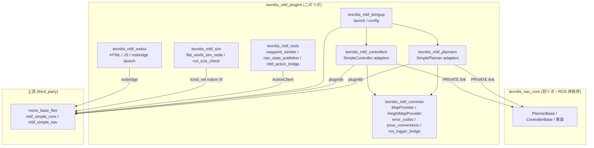
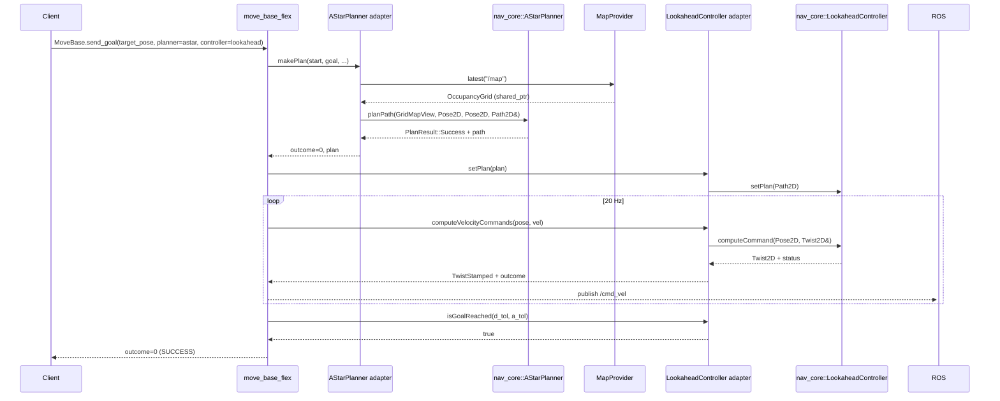

# アーキテクチャ概観

## レイヤ図

## パッケージの責務

| パッケージ | 責務 | build_type |
|---|---|---|
| `texnitis_mbf_common` | 全アダプタが共有する MapProvider・エラー変換・ロガーブリッジ・型変換 | ament_cmake (SHARED) |
| `texnitis_mbf_planners` | `SimplePlanner` を継承する **薄い** アダプタ。実体は nav_core | ament_cmake (SHARED) |
| `texnitis_mbf_controllers` | `SimpleController` を継承する **薄い** アダプタ。実体は nav_core | ament_cmake (SHARED) |
| `texnitis_mbf_bringup` | mbf を立ち上げる launch + yaml | ament_cmake (純 launch) |
| `texnitis_mbf_tools` | mbf アクションを叩く Python ツール群 | ament_cmake + ament_cmake_python |
| `texnitis_mbf_sim` | 軽量 2D ROS 2 シム + 1 ゴール E2E チェック（CI 用） | ament_cmake + ament_cmake_python |
| `texnitis_mbf_webui` | HTML/JS の WebUI と rosbridge launch | ament_cmake (静的アセット) |

## 1 ゴール走破の流れ

## 依存方向の原則

- **アダプタは薄く、実装は nav_core**: ROS 依存は型変換・パラメータ宣言・logger 注入だけ
- **costmap_2d 不在の埋め合わせ**: `MapProvider` シングルトンで `/map` を node 単位に 1 回購読
- **エラー変換は 1 箇所**: `error_codes.hpp` にすべての enum→outcome 対応を集約
- **TF 利用は仲介層を通す**: 直接 `tf2_ros::Buffer` を触らず、controller の `initialize` で受け取った
  shared_ptr を保持するだけ
