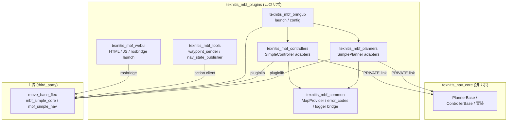

# アーキテクチャ概観

## レイヤ

## パッケージの責務

| パッケージ | 責務 |
|---|---|
| `texnitis_mbf_common` | 全アダプタが共有する MapProvider・エラー変換・ロガーブリッジ・型変換 |
| `texnitis_mbf_planners` | `mbf_simple_core::SimplePlanner` を継承する **薄い** アダプタ。実体は nav_core |
| `texnitis_mbf_controllers` | `mbf_simple_core::SimpleController` を継承する **薄い** アダプタ。実体は nav_core |
| `texnitis_mbf_bringup` | mbf を立ち上げる launch + yaml |
| `texnitis_mbf_tools` | mbf アクションを叩く Python ツール群（ament_cmake + ament_cmake_python） |
| `texnitis_mbf_webui` | HTML/JS の WebUI と rosbridge launch |

## 依存方向の原則

- **アダプタは薄く、実装は nav_core**: ROS 依存は `package.xml` のレイヤ（type 変換・パラメータ・logger）に閉じる
- **costmap_2d 不在の埋め合わせ**: `MapProvider` シングルトンで /map を node 単位に 1 回だけ購読
- **エラー変換は 1 箇所**: `texnitis_mbf_common::error_codes` にすべての enum→outcome 対応を集約
