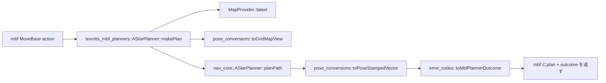
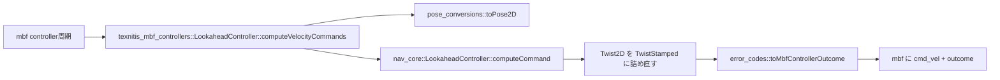

# コードリーディングガイド

## 1 リクエストの流れ（mbf 経由）





## 最初に読む 5 ファイル


1. `error_codes.hpp` — nav_core enum と mbf outcome の対応。テスト容易
2. `map_provider.hpp` — node 単位シングルトン + reliable transient_local QoS
3. `astar_planner.cpp`（mbf アダプタ）— 「アダプタが薄い」とは何かの代表例
4. `lookahead_controller.cpp`（mbf アダプタ）— Controller 側のテンプレート
5. `texnitis_mbf.launch.py` — 全部を起動するエントリポイント

## 内部用語集

| 用語 | 意味 |
|---|---|
| **アダプタ層** | `mbf_simple_core::SimplePlanner / SimpleController` を継承し、内部で nav_core に委譲する薄いラッパ |
| **MapProvider** | mbf プラグイン全体で共有する `/map` 購読シングルトン。`HeightMapProvider` は別系統 |
| **outcome** | mbf アクションが返す `uint32_t` ステータスコード（0=SUCCESS など） |
| **logger bridge** | `nav_core::LoggerFn` (`std::function`) と `rclcpp::Logger` をつなぐヘッダオンリ helper |
| **vcs import** | `*.repos` で記述したリポ群を colcon workspace に取り込むコマンド |
| **stateful GoalChecker** | XY 到達フラグが一度立ったら剥がさない（nav_core 側機能） |

## ファイルツリーの歩き方

```text
texnitis_mbf_plugins/
├── texnitis_mbf_common/         ← まずここを把握
│   ├── include/texnitis_mbf_common/
│   │   ├── map_provider.hpp           ← /map 購読シングルトン
│   │   ├── height_map_provider.hpp    ← /height_grid 購読シングルトン
│   │   ├── error_codes.hpp            ← outcome ↔ enum 対応表
│   │   ├── pose_conversions.hpp       ← ROS 型 ↔ POD 型変換
│   │   └── ros_logger_bridge.hpp      ← LoggerFn → rclcpp::Logger
│   └── src/{map_provider,height_map_provider}.cpp
├── texnitis_mbf_planners/       ← Planner アダプタ群
├── texnitis_mbf_controllers/    ← Controller アダプタ群
├── texnitis_mbf_bringup/        ← launch + yaml
├── texnitis_mbf_tools/          ← Python tool 群
├── texnitis_mbf_webui/          ← HTML/JS + rosbridge launch
├── third_party/move_base_flex.repos
├── docs/                        ← このディレクトリ
└── .github/workflows/ci.yml
```

## 「なぜこうなっているか」を追いたいときは

[design_rationale.md](design_rationale.md) に判断 → 検討案 → 採用理由を残しています。
nav_core 側の同名ファイルと併せて読むと、リポ分割の意図が掴めます。
